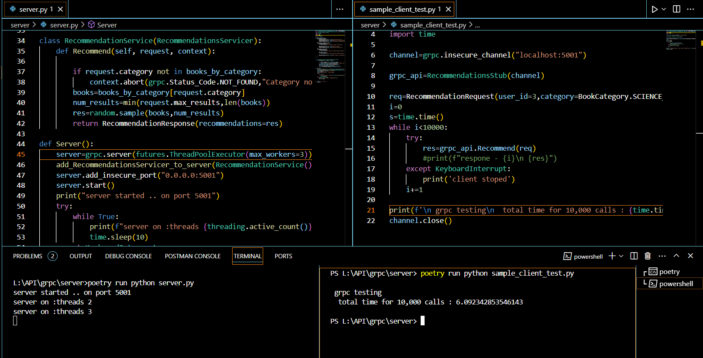

## grpc - python

### index

- [simple code details](#code)
- [grpc python docs](#grpc---python-docs)

## code

### Its a simple grpc with a single method which returns a listed recommendations

#### file descriptions:

1. `protobufs/*.proto` -> contain proto definitions

2. `server/server.py` -> main grpc server
3. `Protobuf_generated/ *.py` -> proto generated files
4. `server/Sample_client_test.py` -> sample client to test 10,000 calls ( in time)
5. `server/interceptor.py` -> sample grpc interceptor

### To run the code

1. install dependencies

```
pip install -r requirements.txt
or
poetry install
```

2. if no proto genearted files or any changes done to proto file run (if you dont use poetry remove `poetry run` from below command)

```sh
poetry run python -m grpc_tools.protoc -I ../protobufs --python_out=./protobuf_generated  --grpc_python_out=./protobuf_generated  ../protobufs/recommendations.proto
```

3. run the server

```
poetry run python server.py
```

4. run client

```
poetry run python Sample_client_test.py
```

### Result

#### for 10,000 calls with 3 threads took 6sec



## grpc - python docs

### grpc - google ( remote procedure call)

### Features

- fast & simple
- language agnostic
- HTTP/2 based communication
- communication in Binay Format (protobufs used to serialize & deserialize data)
- proto file definition required that can generate client and server code
- built in load balancer ...

## workflow

1. define proto file
2. generate server, stub , type definitions with grpcio-tools
3. write service methods and create server
4. generate client stub or code in language of your choice to access server
5. (optional) use interceptors for Authentication , monitoring ...

### 1. sample proto file

```c++
syntax="proto3";


service Recommendations {
rpc Recommend(RecommendationRequest)  returns (RecommendationResponse);
}

message RecommendationRequest{
int32 user_id = 1;
string category = 2;
int32 max_results = 3;
}

message BookRecommendation{
    int32 id = 1;
    string title = 2;
}

message RecommendationResponse{
    repeated BookRecommendation recommendations = 1;
}

```

1. syntax - > version of syntax ( proto2 , proto3)

2. service -> its the service name with methods inside as rpc method_name (eg: http://domain.com/service_name/method_name)
3. message -> request, response definions for serializing

### 2. server,client stub generation

```sh
python -m grpc_tools.protoc -I ../protobufs --python_out=./protobuf_generated  --grpc_python_out=./protobuf_generated  ../protobufs/recommendations.proto
```

### 3. rpc methods & server

#### rpc servicer

```python
class RecommendationService(RecommendationsServicer):

    def Recommend(self, request, context):
        books=books_by_category[request.category]
        num_results=min(request.max_results,len(books))
        res=random.sample(books,num_results)
        return RecommendationResponse(recommendations=res)
```

1. class imports `RecommendationsServicer` which is generated from proto file Recommendations service
2. methods name should be same as rpc methods of service in proto file
3. `RecommendationResponse` is a serializer for response generated from proto

#### server

```python
def Server():
    interceptors=[ErrorLogger()]
    server=grpc.server(futures.ThreadPoolExecutor(max_workers=3),interceptors=interceptors)
    add_RecommendationsServicer_to_server(RecommendationService(),server)
    server.add_insecure_port("0.0.0.0:5001")
    server.start()
```

### 4. Client

generate client code in any language you want to access from proto file

#### sample client in python

```python
from protobuf_generated.recommendations_pb2 import BookCategory,RecommendationRequest
from protobuf_generated.recommendations_pb2_grpc import RecommendationsStub
import grpc

channel=grpc.insecure_channel("localhost:5001")

grpc_api=RecommendationsStub(channel)

req=RecommendationRequest(user_id=3,category=3 ,max_results=3)
res=grpc_api.Recommend(req)
print(res)
```

### 5 Interceptors

can be useful for Authentication,..
in python use `grpc-interceptor`

#### sample interceptor in python

```python
from grpc_interceptor import ServerInterceptor

class ErrorLogger(ServerInterceptor):
    def intercept(self, method, request, context, method_name):
        try:
            print("----- intercptor ------")
            return method(request, context)
        except Exception as e:
            self.log_error(e)
            raise

    def log_error(self, e: Exception) -> None:
        print(e)
```
